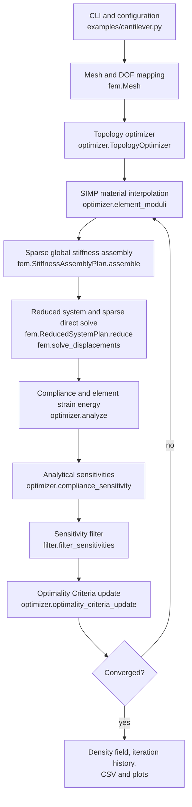

# Topology Optimization

A lightweight 2D structural topology optimization platform focused on **numerical
algorithms**, **software architecture** and **performance engineering**.

It solves the classic minimum-compliance cantilever with density-based (SIMP)
topology optimization on a structured Q4 mesh: finite element analysis, analytical
sensitivities, sensitivity filtering, and an Optimality Criteria design update,
wrapped in a benchmark harness that measures the result reproducibly.

This is a study-scale implementation, not a commercial CAE package. It handles one
problem family on one mesh topology, and it is deliberately small enough to read
end to end.

## Example result


*The canonical cantilever example: 60 × 20 elements, volume fraction 0.40, SIMP
penalty $p = 3$ and sensitivity-filter radius $r_{\min} = 1.5$, converged in 44
iterations.*

## What this project demonstrates

| Area | Evidence |
|---|---|
| Numerical methods | Q4 plane-stress FEA, SIMP interpolation, self-adjoint compliance sensitivities, cone filter, Optimality Criteria |
| Verification | Closed-form element energies, a constant-strain patch test, a beam-theory sanity check, filter and OC properties, and bit-exact cross-checks against a reference assembly path |
| Performance engineering | A frozen baseline, an instrumented stage partition, and three controlled experiments — each measured, each checked for numerical equivalence |
| Engineering judgment | An iterative-solver replacement was investigated and **rejected on evidence**; a direct-solver ordering change was adopted instead |

The performance work reduced end-to-end runtime by **1.26× to 1.88×** across the
canonical meshes, and cut solver memory by 12% at the largest case. Details and
negative results are in [`docs/performance.md`](docs/performance.md).

## Capabilities

- structured rectangular 2D mesh, 4-node (Q4) plane-stress elements, 2 DOF per node
- sparse global stiffness assembly in CSC format, with cached sparsity structure
- linear elastic material with SIMP density interpolation
- compliance minimization under a volume-fraction constraint
- analytical compliance sensitivities (the problem is self-adjoint)
- cone-weighted sensitivity filtering to suppress checkerboarding
- Optimality Criteria density update with a bisection volume multiplier
- convergence tracking on the maximum density change
- CLI execution, topology and convergence plots, CSV iteration history
- a synchronous FastAPI backend that runs the same solver over HTTP
- pytest numerical validation, including regression tests for the performance work
- reproducible benchmark harness with stage-level instrumentation and peak-RSS capture

Deliberately **not** implemented: 3D, unstructured meshes, multiple load cases, and
other physics (thermal, buckling, stress constraints). The HTTP backend is
synchronous and stateless; absent are the job queues, persistence, authentication
and container setup a hosted service would need.

## Architecture

Data flow through one optimization iteration. Everything except the CLI and the
benchmark harness is in the `topoopt` package.



Two structures are built once and reused for the whole run, because the mesh and
the boundary conditions fix them and only the density changes:

- `fem.StiffnessAssemblyPlan` — the CSC sparsity pattern and the scatter map from
  element entries to global slots
- `fem.ReducedSystemPlan` — which global entries survive the elimination of the
  restrained degrees of freedom, and the reduced CSC structure

## Numerical method

### 1. Problem statement

The optimizer solves the minimum-compliance problem

$$
\begin{aligned}
\min_{\mathbf{x}} \quad & c(\mathbf{x}) = \mathbf{u}^{\mathsf{T}} \mathbf{K}(\mathbf{x}) \, \mathbf{u} \\
\text{subject to} \quad & \mathbf{K}(\mathbf{x}) \, \mathbf{u} = \mathbf{F} \\
& \frac{1}{n_e} \sum_{e=1}^{n_e} x_e \le f \\
& x_{\min} \le x_e \le 1
\end{aligned}
$$

where $\mathbf{x} = (x_e)$ collects the element densities of the $n_e$ elements,
$\mathbf{u}$ is the nodal displacement vector, $\mathbf{K}$ the global stiffness
matrix, $\mathbf{F}$ the load vector, $f$ the prescribed volume fraction (the
`volfrac` parameter) and $x_{\min}$ the lower density bound (the `min_density`
parameter). Element volumes are one on this mesh, so the volume constraint bounds
the mean density.

The domain is a regular grid of `nelx` × `nely` bilinear quadrilaterals of unit
edge length, so it is `[0, nelx] × [0, nely]`. Nodes are numbered row-major with
the $x$ index fastest.

### 2. Element stiffness

For element $e$,

$$
\mathbf{K}_e = \int_{\Omega_e} \mathbf{B}^{\mathsf{T}}\mathbf{D}\mathbf{B}\,\mathrm{d}\Omega
$$

with $\mathbf{D}$ the plane-stress constitutive matrix, integrated with 2×2 Gauss
quadrature. The rule is exact here: on a rectangle the integrand is at most
quadratic in each natural coordinate.

### 3. Material interpolation (SIMP)

$$
E_e(x_e) = E_{\min} + x_e^{p} \left( E_0 - E_{\min} \right)
$$

where $p$ is the penalty exponent (the `penal` parameter), $E_0$ the solid modulus
and $E_{\min}$ the void modulus. Their ratio $E_{\min} / E_0$ is the
`void_modulus_ratio` parameter, set to $10^{-9}$ so the stiffness matrix stays
non-singular.

### 4. Assembly and equilibrium

The global stiffness matrix is assembled in CSC format and the restrained degrees
of freedom are eliminated, leaving the reduced equilibrium system

$$
\mathbf{K}_{ff} \, \mathbf{u}_f = \mathbf{F}_f
$$

over the free degrees of freedom. It is solved with
`scipy.sparse.linalg.spsolve` (SuperLU) using a fill-reducing column ordering.

### 5. Sensitivities

For a fixed load the problem is self-adjoint, so

$$
\frac{\partial c}{\partial x_e} = -p \, x_e^{p-1} \left( E_0 - E_{\min} \right) \mathbf{u}_e^{\mathsf{T}} \mathbf{k}_0 \, \mathbf{u}_e
$$

where $\mathbf{u}_e$ is the element displacement vector and $\mathbf{k}_0$ the
unit-modulus element stiffness matrix. The compliance equals the sum of the
element strain energies, which the test suite checks directly.

### 6. Sensitivity filter

Raw element sensitivities are replaced by a cone weighted average over the
neighbourhood,

$$
\frac{\partial \tilde{c}}{\partial x_e} = \frac{\sum_f H_{ef} \, x_f \, \dfrac{\partial c}{\partial x_f}}{x_e \sum_f H_{ef}},
\qquad
H_{ef} = \max\left( 0, \; r_{\min} - \lVert \mathbf{y}_e - \mathbf{y}_f \rVert \right)
$$

where $\mathbf{y}_e$ is the centroid of element $e$ and $r_{\min}$ the filter
radius (the `rmin` parameter). This is the Sigmund–Petersson filter in its
sensitivity form; it leaves the finite element analysis untouched. `rmin` is
measured in **element units**, so it is not a fixed physical length when the mesh
is refined, and $r_{\min} \le 1$ has no effect, since no neighbour lies inside the
cone.

### 7. Design update

Optimality Criteria: stationarity of the Lagrangian gives

$$
B_e = x_e \sqrt{-\frac{1}{\lambda} \frac{\partial \tilde{c}}{\partial x_e}},
\qquad
x_e \leftarrow \mathrm{clip}_{[x_{\min}, \, 1]} \left( \mathrm{clip}_{[x_e - m, \, x_e + m]} \left( B_e \right) \right)
$$

with $\lambda$ the volume-constraint multiplier found by bisection and $m$ the
move limit (the `move` parameter).

### 8. Convergence

The loop stops when

$$
\max_e \left| x_e^{(k+1)} - x_e^{(k)} \right| < \tau
$$

or at the iteration cap, where $k$ indexes the iteration and $\tau$ is the
convergence tolerance (the `tolerance` parameter, exposed as `--tol`).

The implementation lives in [`topoopt/fem.py`](topoopt/fem.py),
[`topoopt/filter.py`](topoopt/filter.py) and
[`topoopt/optimizer.py`](topoopt/optimizer.py).

## Validation

The test suite checks the numerical building blocks individually, not only the
end-to-end run:

- **Element level** — constitutive matrix symmetry and positive definiteness, the
  element stiffness matrix's symmetry, positive semi-definiteness and three
  rigid-body null modes, and its strain energy against the closed-form
  constitutive law for uniaxial and shear strain. A square element's stiffness is
  also checked to be independent of element size.
- **Mesh and DOF mapping** — row-major node numbering, element DOF ordering,
  and the property that element DOFs cover every global DOF exactly once.
- **System level** — global stiffness symmetry and annihilation of rigid
  translation, scaling with the element moduli, and a **constant-strain patch
  test** with analytical consistent nodal loads, which the element space
  reproduces to machine precision.
- **Assembly and reduction** — the cached assembly and the cached reduced-system
  extraction are compared **bit-for-bit** against the explicit reference paths,
  and the reduced-system plan is checked to reject structures it does not match.
- **Physics sanity check** — a solid slender cantilever's compliance is compared
  against Timoshenko beam theory with a shear correction factor. A
  displacement-based finite element model is stiffer than the exact solution, so
  the computed compliance is asserted to sit just below the beam estimate (within
  3%). This is a sanity check on one slender mesh, not a reference solution.
- **Filter** — kernel weights and symmetry, row sums, radius cutoff, preservation
  of a uniform field, spreading of a point sensitivity, and finiteness at the
  density lower bound.
- **Optimizer** — OC bounds and move limit, the volume constraint, compliance
  equalling the summed element strain energies, non-positive sensitivities, and a
  small cantilever smoke test that the loop converges to a finite improved design.
- **Performance regressions** — the assembly and reduced-system caches are held to
  bit-exact equivalence with the paths they replaced, and the SuperLU ordering
  change is held to numerical equivalence with a documented tolerance.

### Convergence example


*Per-iteration history for the same run. The volume fraction stays at the prescribed
0.40 throughout, and the loop stops at iteration 44 when the maximum density change
falls below the $10^{-2}$ tolerance — the stopping criterion defined in
[step 8](#8-convergence) above.*

No comparison against commercial finite element software has been performed, and
no such claim is made.

## Performance

Measured on the three canonical meshes with the benchmark harness. Runtime is
**machine-dependent** — compare ratios measured on the same host, not absolute
seconds across machines.

| Mesh | Elements | DOFs | Iterations | `v0.1-reference` | `v0.3-performance` | Cumulative speedup |
|---|---:|---:|---:|---:|---:|---:|
| 60×20 | 1 200 | 2 562 | 44 | 0.183 s | 0.145 s | **1.26×** |
| 120×40 | 4 800 | 9 922 | 61 | 2.362 s | 1.260 s | **1.88×** |
| 240×80 | 19 200 | 39 042 | 76 | 15.526 s | 9.922 s | **1.56×** |

Times are the mean of three clean runs of `TopologyOptimizer.run()`, after one
discarded warm-up. All three cases converge in every build, to the same iteration
count (44 / 61 / 76) and to the same design to within 4e-11 relative.

Benchmark environment: CPython 3.12.14, NumPy 2.5.3, SciPy 1.18.1, Darwin 25.5.0
on `arm64` (Apple Silicon, `hw.model` Mac17,3), 10 CPUs, BLAS thread environment
variables unset. Recorded in
[`benchmarks/results/optimized_ordering_environment.json`](benchmarks/results/optimized_ordering_environment.json).

The work proceeded in three measured steps:

1. **Sparse assembly structure caching** — the sparsity pattern and scatter map
   are invariant across iterations, so they are computed once. Assembly dropped
   4.4–5.2×, which was worth 1.03–1.10× end to end.
2. **Reduced-system extraction caching** — the free/free entry selection is
   likewise fixed by the mesh and the boundary conditions. `solve_reduce` dropped
   ~7×, worth 1.01–1.05× end to end.
3. **SuperLU fill-reducing ordering** — selecting `MMD_AT_PLUS_A`, a
   minimum-degree ordering on a symmetric structure, in place of the default
   `COLAMD`. `solve_numeric` improved 1.11–1.82×, worth 1.09–1.76× end to end,
   and peak solver memory fell at the larger meshes.

The first two steps produced large *local* wins and small *end-to-end* wins,
because the sparse solve was never their bottleneck and its share grows with mesh
size. The third step targeted that bottleneck directly. The three are
independent and compose multiplicatively; see
[`docs/performance.md`](docs/performance.md) for the per-stage breakdown, the
memory progression, and the iterative-solver investigation that was rejected.

## Quick start

Python 3.10 or newer. Runtime dependencies are NumPy, SciPy and Matplotlib.

```bash
python -m venv .venv
source .venv/bin/activate          # Windows: .venv\Scripts\activate
pip install -e .
```

For the test suite, install the development extra:

```bash
pip install -e ".[dev]"
```

Run the canonical cantilever:

```bash
python -m examples.cantilever --nelx 60 --nely 20 --volfrac 0.4 --penal 3.0 --rmin 1.5
```

It prints one line per iteration (iteration, compliance, volume fraction, maximum
density change, iteration time) and writes three files into `results/`:

| File | Contents |
|---|---|
| `topology.png` | the optimized density field |
| `convergence.png` | compliance, volume fraction and density change per iteration |
| `history.csv` | the same per-iteration numbers, for later analysis |

`--max-iter`, `--tol` and `--output-dir` are also available; run with `--help`
for the full list. Plotting uses the non-interactive Agg backend, so the example
runs from a terminal without a display. `results/` is generated and not tracked.

## Running the tests

```bash
pytest
```

`pyproject.toml` points pytest at `tests/` and puts the repository root on the
import path, so no additional configuration is needed.

The run reports one `StarletteDeprecationWarning` about `httpx`. Starlette's
`TestClient` now prefers `httpx2` and warns when it falls back to the
conventional `httpx`; the fallback works, so the suite stays on the ordinary
FastAPI testing stack rather than adding a second HTTP client.

## Running the benchmarks

```bash
python benchmarks/benchmark.py --label my-experiment --output-dir /tmp/bench-out
```

> **Existing results are never replaced by default.** A run writes
> `<label>.csv`, `<label>_stages.csv` and `environment.json` into its output
> directory, and refuses to start — before measuring anything — if that label's
> artifacts are already there. The message names the conflicting paths and the
> three ways out: a different `--label`, a different `--output-dir`, or
> `--overwrite`.

Because `--label` defaults to `reference`, that refusal is what protects the
frozen baseline: a bare `python benchmarks/benchmark.py` stops and reports the
conflict instead of replacing `benchmarks/results/reference.csv`.

Useful flags:

```bash
python benchmarks/benchmark.py --list-cases                  # sizes without running
python benchmarks/benchmark.py --cases 60x20 120x40 --label subset \
    --output-dir /tmp/bench-out
python benchmarks/benchmark.py --cases 60x20 --repetitions 1 --warmups 0 \
    --label quick --output-dir /tmp/bench-out                # fast pass
python benchmarks/benchmark.py --label quick --overwrite \
    --output-dir /tmp/bench-out                              # replace a label
python benchmarks/benchmark.py --in-process --label debug \
    --output-dir /tmp/bench-out                              # memory unreliable
```

`--cases` accepts any `NELXxNELY`, including sizes outside the canonical three.
Larger meshes get expensive quickly — the sparse factorization grows faster than
the problem, and a `480x160` case needs several GB. `benchmarks/README.md` gives
the estimate.

## Running the API

A small synchronous HTTP backend exposes the same solver. Install its
dependencies into the same environment:

```bash
pip install -e ".[api]"
```

Start it from the repository root:

```bash
uvicorn api.main:app --reload
```

| Endpoint | Purpose |
|---|---|
| `GET /health` | liveness probe; returns `{"status": "ok"}` |
| `POST /api/v1/optimize` | run the canonical cantilever and return the density field |

Every field is optional and defaults to the value the example and the benchmark
suite use, so the canonical run is one request:

```bash
curl -X POST http://127.0.0.1:8000/api/v1/optimize \
  -H 'Content-Type: application/json' \
  -d '{"nelx": 60, "nely": 20, "volfrac": 0.4, "penal": 3.0, "rmin": 1.5}'
```

The response carries the optimized density field as `nely` rows of `nelx` values,
alongside the convergence history and the final scalars — numbers, not images, so
a frontend renders the result itself. Interactive documentation is at
<http://127.0.0.1:8000/docs>, and the raw schema at `/openapi.json`.

The endpoint is synchronous: FastAPI runs it in a worker thread, but it blocks
until the optimization finishes — about 0.15 s for the default 60×20 mesh. Cost
grows quickly with mesh size and V1 imposes no upper bound on the mesh
dimensions, so a very large request will hold a thread for a long time.

Benchmark runtime and memory are machine-dependent, and results vary with CPU, OS,
SciPy build, thermal state and background load. The tracked numbers above were
produced with the default methodology (one warm-up, three clean repetitions, one
subprocess per case). Read [`benchmarks/README.md`](benchmarks/README.md) for the
methodology and its caveats before comparing builds.

## Project structure

```
topoopt/
    fem.py              mesh, element stiffness, sparse assembly, reduced solve
    filter.py           cone filter kernel and sensitivity filtering
    optimizer.py        SIMP minimum compliance with an Optimality Criteria update
    problems.py         the canonical cantilever, shared by the CLI, API and benchmarks
examples/
    cantilever.py       CLI, plotting and CSV history for the canonical problem
api/
    main.py             FastAPI application and the two endpoints
    models.py           request and response models
    service.py          adapter from a validated request to one core run
tests/
    test_fem.py         element, assembly, reduction and solve validation
    test_filter.py      filter kernel and filtering behaviour
    test_optimizer.py   OC update, sensitivities, end-to-end smoke tests
    test_problems.py    the shared problem definition and its import boundary
    test_benchmark.py   overwrite protection in the benchmark harness
    test_api.py         endpoints, validation and core equivalence
benchmarks/
    benchmark.py        reproducible harness: parent orchestration and worker
    README.md           methodology, output schema and measurement caveats
    results/            tracked benchmark artifacts, four labels
docs/
    performance.md      the performance-engineering record
    images/             curated example outputs used by this README
```

## Limitations and roadmap

**Scope limits.** 2D only, on a structured rectangular mesh, with a single load
case and linear elastic material. No stress, buckling or thermal constraints. The
filter radius is expressed in element units, so refining the mesh changes the
effective physical filter length. Nothing here has been validated against
commercial finite element software.

**The solver is still the bottleneck.** `solve_numeric` accounts for 83–95% of
per-iteration time in the current build, and the fitted growth of the sparse
factorization is roughly `O(n_dofs^1.5)` between the smallest and largest
canonical mesh — faster than the problem size itself. Peak memory grows the same
way. The ordering change lowered the constant factor; it did not change the
exponent.

Directions that would be worth investigating, none of them attempted here:

- alternative sparse direct solvers with better fill or memory behaviour
- reuse of the symbolic factorization, which is invariant across iterations but
  not exposed by SciPy's public API
- stronger iterative preconditioning (multilevel or incomplete factorization),
  which the simple preconditioners tested so far did not make competitive

These are open questions, not planned work.
